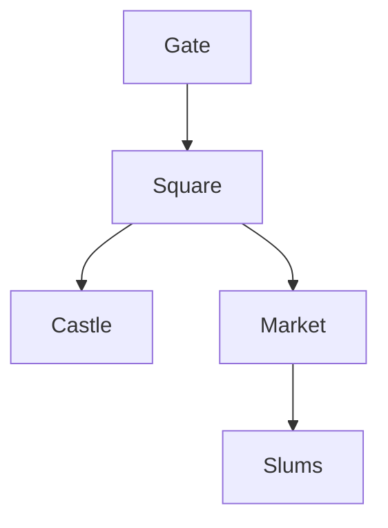

## User Input

```text
$ARGUMENTS
```

You **MUST** consider the user input before proceeding (if not empty). Support both location ID (location-xxx) and name matching.

## Process Overview

This command generates or displays a map visualization for a location. If no map exists, it offers to generate one through an interactive process.

### Process Steps

1. **Identify Location**: Parse ID/name from `$ARGUMENTS` or prompt user
2. **Load Location Profile**: Read existing location file
3. **Check Existing Map**: Check if map already exists in file
4. **Interactive Map Generation** (if needed): Ask user about map preferences
5. **Generate Map**: Create map based on location description and user preferences
6. **Save Map**: Append map to location file

## Context Loading

### Required Context

1. **Location Profile** (REQUIRED):
   - Read `./world/locations/[location-id]/location.md` (user space, project root)
   - Extract: location description, structure, districts, points of interest

2. **World Information** (If needed):
   - Read `./world/worldview.md` for geographic context
   - Check related locations for connections

## Interactive Map Generation

**If no map exists in the file, offer to generate one through an interactive process.**

### Interview Principles

1. **Question Format** (MANDATORY):
   - Each question must provide **at least 6 options** (A-F) plus Custom
   - Options must be **mutually exclusive and non-repetitive**
   - Clearly state: "You can also enter your own custom input if none of the options fit"

2. **Dynamic Flow**:
   - Each round: AI decides whether to continue based on confirmed information
   - Questions adapt based on previous answers
   - Follow-up questions only when needed

3. **Information Confirmation**:
   - All preferences must be marked as **"confirmed"** or **"unconfirmed"**
   - For unconfirmed information, AI must continue asking or provide more options

4. **Completeness Threshold**:
   - Before final generation, verify all necessary information is confirmed
   - If information is insufficient, actively point out missing items
   - Do NOT proceed to generation until all required fields are confirmed

### Generation Questions

#### Question 1: Map Format

Present 6+ options:
- A) Text Layout (ASCII art style)
- B) Mermaid Graph (Flowchart showing connections)
- C) List Format (Hierarchical list of zones)
- D) Grid Layout (Grid-based representation)
- E) Network Diagram (Node-based connections)
- F) Hybrid (Combination of formats)
- Custom: [User input]

#### Question 2: Detail Level

Present 6+ options:
- A) High detail (all zones, connections, descriptions)
- B) Medium detail (main zones, key connections)
- C) Low detail (overview only, major areas)
- D) Custom detail level
- E) Match location description detail
- F) Let system decide based on location complexity
- Custom: [User input]

#### Question 3: Include Connections

Present 6+ options:
- A) Show all connections between zones
- B) Show only major connections
- C) Show hierarchical connections only
- D) Show directional connections (one-way, two-way)
- E) No connections, zones only
- F) Custom connection style
- Custom: [User input]

#### Question 4: Additional Elements

Present 6+ options (allow multiple):
- A) Include points of interest (POIs)
- B) Include landmarks
- C) Include entry/exit points
- D) Include district labels
- E) Include scale/distance indicators
- F) Include legend/key
- Custom: [User input]

#### Question 5: Style Preferences

Present 6+ options:
- A) Simple and clean
- B) Detailed and decorative
- C) Functional/minimalist
- D) Artistic/stylized
- E) Technical/precise
- F) Match location atmosphere
- Custom: [User input]

## Map Generation

After collecting all preferences:

1. **Analyze Location Description**: Extract zones, connections, features from location profile
2. **Generate Map**: Create map based on:
   - Location description
   - User preferences
   - World context
3. **Format Map**: Format according to selected format (Text/Mermaid/List/etc.)

### Map Formats

#### Text Layout Example:
```
[Location Name]
├── [Zone 1]
│   ├── [Sub-zone 1.1]
│   └── [Sub-zone 1.2]
├── [Zone 2]
└── [Zone 3]
```

#### Mermaid Graph Example:


## Save Map

Append the generated map to the `location.md` file under a `## Map` section:

```markdown
## Map

[Generated map content here]

**Generated**: [Date]
**Format**: [Format type]
**Detail Level**: [Level]
```

## State Machine Update

After saving map:

1. Read `.novelkit/memory/config.json`
2. Update `session.last_action`: "Generated map for location [location-id] ([Name])"
3. Update `session.last_action_time`: [current timestamp]
4. Update `session.last_action_command`: "location-map"
5. Update `session.last_modified_file`: `./world/locations/[location-id]/location.md`
6. Add to `history.recent_actions` array (keep last 20)
7. Update `last_updated`: [current timestamp]
8. Save updated config.json

## Error Handling

- **Location Not Found**: List similar names, suggest creating new location
- **File Read Error**: Report error, check file permissions
- **Insufficient Description**: Warn user that map may be incomplete, suggest updating location description first
- **Generation Error**: Report error, suggest manual map creation

## Important Notes

- **Dynamic interview**: Questions, order, and depth are determined by AI based on context
- **Minimum 6 options**: Every question must have at least 6 options (A-F) plus Custom
- **Information confirmation**: All preferences must be confirmed before generation
- **Completeness check**: Verify all necessary information before generating map
- **User control**: User can skip, go back, or cancel at any time
- **Map updates**: If map exists, ask if user wants to regenerate or update
